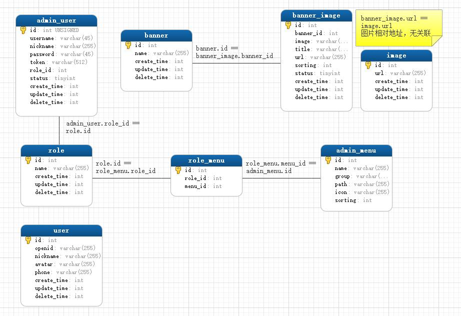

# tp6-vue-hyc

一套由打工人hyc组合出来的、很精简的、具有菜单级精简权限管理的、不算那么完美的、但是又可以应付很多需求的、用tp6+vue2+antdv攒起来的方案。

## 核心理念

- [x] 快速实现需求
- [x] 简约易上手
- [ ] ~~模块化封装~~
- [ ] ~~人力部署~~
- [ ] ~~人力测试~~
- [ ] ~~后期维护~~
- [ ] ~~运行性能~~
- [x] 能跑就行

## 《菜单级》权限管理
通过后端接口获取当前账号下可以访问的页面列表，使用vue-router来添加这些页面，所以只是实现了后台的前端页面的隐藏。可自行在中间件层实现后端接口的限制访问，可在`admin_menu`表中追加字段。

## 运行环境参考
- PHP 7.3
- Node 16.10
- Mysql 5.6
- HBuilderX 3.2.9 （如果需要uniapp）

## 数据库关系

- 导表`./tp6_vue_hyc.sql`
- 数据库关系图


## 运行

### 后端

1. 复制`./backend/.example.env`到`./backend/.env`文件，根据您的实际情况修改数据库参数。
> 可参考[ThinkPHP6.0手册-环境变量定义](http://static.kancloud.cn/manual/thinkphp6_0/1037484)

2. 运行
```
cd ./backend
composer install
php think run 或者搭建php-fpm环境
```

3. API地址默认是`http://localhost:8000/`

### 管理后台

1. 复制`./dashoard/.env.production`到`./dashoard/.env.development.local`文件。可根据后端实际运行情况修改`VUE_APP_API_BASE_URL`。
> `yarn serve`运行时会读取`.env.development.local`，`yarn build`打包时会读取`.env.production`。

2. 运行
```
cd ./dashboard
yarn 或者 npm install
yarn serve 或者 npm run serve
yarn build 或者 npm run build
```

3. `yarn serve`运行后，浏览器打开`http://localhost:8080`。账号admin，密码123456，可自行在数据库修改，方法是`md5(md5($authCode.$password))`。

### 微信小程序客户端

1.  复制`./client/manifest.example.json`到`./client/manifest.json`文件。参考[uni-app配置项列表](https://uniapp.dcloud.io/collocation/manifest)，根据需要修改。
2. 打开HBuilderX，导入项目`./client`。
3. 根据后端运行的实际情况，可修改`./client/utils/constant.js`中的`REQ_API_HOST`。
3. 运行到小程序模拟器。或者发行小程序-微信。
> 如果不开发微信小程序，相关的登录代码需要重写，详见下文简要说明第9点。

## 简要说明
1. 需要在`admin_menu`表手动配置各个路由菜单。`group`字段会作为菜单分组key，`icon`字段请参考[图标Icon-AntDesignVue](https://antdv.com/components/icon-cn/)。
2. 然后在`role_menu`中添加角色与菜单的绑定关系。
3. 然后在`./dashboard/src/Main.vue`中导入vue页面，然后修改`routeView`中的路径和页面。
```js
import MemberList from './pages/member/MemberList.vue'
import ...

const routeView = {
  'member': MemberList,
  'account': AccountList,
  'account/save': AccountSave,
  'role': RoleList,
  'role/save': RoleSave,
  'bannerImage': BannerImageList,
  'bannerImage/save': BannerImageSave,
}
```
4. `./backend/config/jwt.php`，可修改`jwt_key`字段。
5. `./backend/app/model`中添加新实体类，继承Base类。
6. `./backend/app/common.php`中实现了一些常用的方法，包括了包装返回值json的方法，默认返回code==1时代表成功，返回code==10001时代表登录失效。
7. 在一些需要分页的列表接口，默认用`page_size`字段代表每页返回的数量，当`page_size <= 0`时不分页，当`page_size`为空值时默认每页20条。
8. `Banner`与`BannerImage`相关的表和实体作为演示使用。`banner`表需手动增删条目，`banner_image.banner_id`关联`banner.id`，表示显示在哪个位置的轮播图，在客户端不同位置用`banner_id`获取不同的轮播图列表。
9. `./client/pages/my/my.vue`以及`./backend/app/api/controller/User.php`等用户相关代码是微信小程序代码，使用easywechat4实现，`./backend/config/wx.php`是easywechat配置文件，可参考[EasyWechat4.x文档](https://www.easywechat.com/4.x/)修改配置。